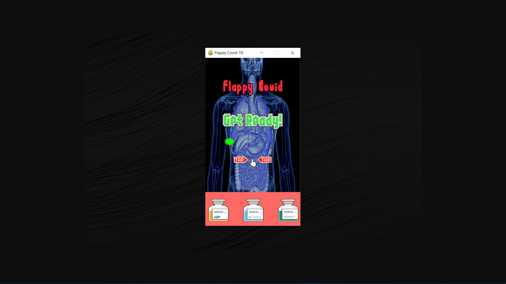
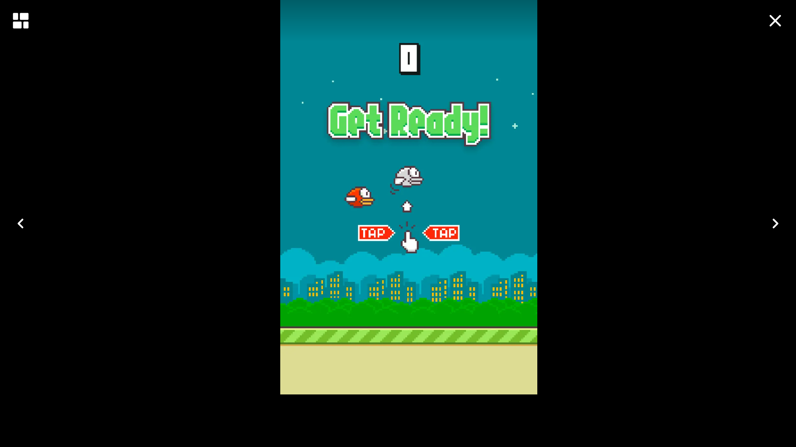

## Informações sobre o código 💻🐱‍👤

Este projeto foi desenvolvido visando uma prova da matéria de 
Algoritmos e Programação, e dada as circunstâncias no cenário 
de Covid-19, o mesmo apresenta o tema em um jogo eletrônico conhecido enfatizando a noção e importância da vacinação no cenário de pandemia. Outro ponto é que este arquivo foi finalizado e entregue em 24 de Junho de 2021.

* _Imagem do game adaptado:_ 

* _Imagem do game clássico:_ 

## O que é necessário para rodar o game no seu PC: 🎮

* Para o funcionamento do código, basta que tenha o python instalado e a biblioteca do pygame. Use [**pip install pygame**] para baixa-la.

## Créditos e informações das referências ✨

Todos os créditos e referências vão ao **_CodeWithHarry_** que ensinou a fazer uma réplica do jogo **Flappy Bird** utilizando a biblioteca **Pygame** para o desenvolvimento. Abaixo deixo os créditos do autor do vídeo de base e também do site e github.

**Vídeo Base:**  
>  <https://www.youtube.com/watch?v=itB6VsP5UnA&t=762s>  

**Site Pessoal:**  
>  <https://www.codewithharry.com>  

**GitHub:**  
>  <https://github.com/CodeWithHarry>  
